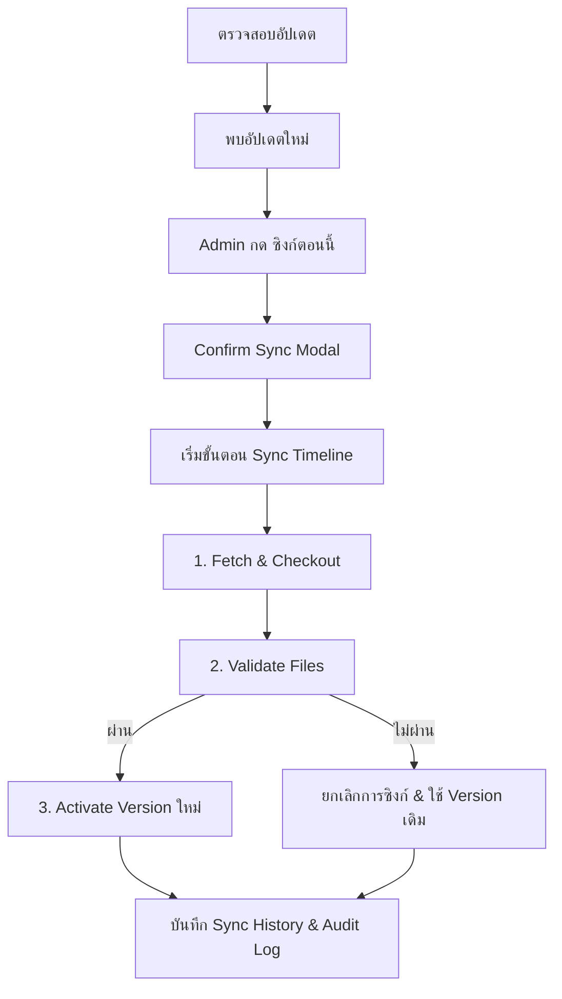
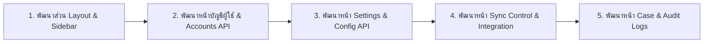

# Admin UX Plan

## Background

chatbot-gate เป็น Ops Support Chatbot Platform (NOC / Operation / Admin) ที่ deploy ด้วย Docker Compose + Nginx บน Ubuntu 26.04
เอกสารนี้อธิบายถึงรูปแบบหน้าจอ (UX/UI Layout) และพฤติกรรม (Behavior) ของผู้ใช้ที่เป็น Admin ในการจัดการระบบผ่าน Web-based GUI ได้แก่ การจัดการผู้ใช้, ซิงก์ความรู้ (Knowledge Sync), ตรวจสอบประวัติเคส (Case Logs), ตรวจสอบประวัติการใช้งาน (Audit Logs) และการตั้งค่าระบบ (Settings)

---

## User Review Required

> [!IMPORTANT]
> **สิทธิ์และการบันทึกข้อมูล**: การจัดการผู้ใช้ (User Management) จะใช้รูปแบบ Soft Delete เพื่อให้ประวัติใน Audit Logs ยังคงอ้างอิงถึงบัญชีผู้ใช้ได้ แม้ผู้ใช้รายนั้นจะถูกลบไปแล้ว

> [!WARNING]
> **ผลกระทบจากการตั้งค่า**: การเปลี่ยนค่าในบาง Section ของหน้า Settings (เช่น การเปลี่ยน Path ของ Repository) อาจส่งผลให้ระบบต้องทำการ restart service ซึ่งจะมี badge แจ้งเตือนสถานะความจำเป็นเด่นชัดใน UI

---

## Core UX & Interface Layout

### Theme & Style
- **Theme**: Dark NOC
- **Color Tone**: Charcoal Black
- **Table Density**: Comfortable
- **Language**: ภาษาไทยทั้งหมดสำหรับปุ่มและ Action

### Admin Sidebar
เมนูนำทางหลักประกอบด้วย:
- **Dashboard** (สำหรับ MVP แรกจะเป็นเพียง Placeholder ไว้ก่อน ยังไม่มีข้อมูลจริง)
- **Manage Account** (จัดการบัญชีผู้ใช้)
- **Knowledge Sync** (ตรวจสอบสถานะและซิงก์ GitHub repository)
- **Case Logs** (ดูประวัติเคส)
- **Audit Logs** (ดูประวัติการดำเนินการระบบ)
- **Settings** (ตั้งค่าระบบ)

---

### 1. Manage Account (การจัดการบัญชีผู้ใช้)
หน้าหลักแสดงตารางผู้ใช้ทั้งหมด:
- **Columns**: ชื่อผู้ใช้ | อีเมล | บทบาท | สถานะ | การจัดการ (ปุ่ม แก้ไข / รีเซ็ตรหัสผ่าน / ลบ)

#### Drawer / Modal สำหรับจัดการบัญชี
- **เพิ่มผู้ใช้**: กดปุ่ม `เพิ่มผู้ใช้` (ขวาบน) -> เปิด Drawer ขวา
  - ฟอร์ม: ชื่อผู้ใช้ (username), อีเมล, บทบาท (NOC / Operation / Admin), รหัสผ่าน, สถานะ (เปิดใช้งาน/ปิดใช้งาน)
  - ปุ่ม: [ยกเลิก] [สร้างผู้ใช้]
- **แก้ไขผู้ใช้**: กดปุ่ม `แก้ไข` ในตาราง -> เปิด Drawer ขวา (แก้ไขได้เฉพาะ: อีเมล, บทบาท, สถานะ เท่านั้น ห้ามแก้ไขชื่อผู้ใช้)
  - ปุ่ม: [ยกเลิก] [บันทึก]
- **รีเซ็ตรหัสผ่าน**: กดปุ่ม `รีเซ็ตรหัสผ่าน` -> เปิด Modal
  - ฟอร์ม: รหัสผ่านใหม่, ยืนยันรหัสผ่าน
  - ปุ่ม: [ยกเลิก] [รีเซ็ตรหัสผ่าน]
- **ลบผู้ใช้**: กดปุ่ม `ลบ` -> Confirm Modal (Soft Delete)
  - ข้อความ: `ต้องการลบผู้ใช้ [username] ใช่ไหม?`
  - ปุ่ม: [ยกเลิก] [ลบ]

---

### 2. Knowledge Sync (ซิงก์ความรู้)
หน้าจอสำหรับจัดการการดึงข้อมูลความรู้ (Knowledge Source) จาก repo `openstack-support` โดยไม่ต้องใช้ Command-line

#### UI Elements
1. **สถานะปัจจุบัน (Current Status)**: แสดง Current Commit, Branch, Last Sync, Last Sync By, Status (Active / Syncing / Failed)
2. **Remote Repository**: แสดง Repo URL, Latest Commit (SHA), Commit Message, Latest Commit Time, Update Available (Yes / No)
3. **Actions**: ปุ่ม [ตรวจสอบอัปเดต] [ซิงก์ตอนนี้]
   * *หมายเหตุ*: เมื่อกด [ซิงก์ตอนนี้] จะมี Confirm Modal แสดงข้อความเตือนการ Validate ความถูกต้องของชุดข้อมูลก่อนซิงก์จริง
4. **Sync Progress**: แสดง Step Timeline: `Fetch` -> `Checkout` -> `Validate` -> `Activate` -> `Completed` (หรือ `Failed`)
5. **Sync History**: ตารางแสดงประวัติย้อนหลัง พร้อมปุ่มดูรายละเอียด Log และผลการตรวจสอบ (Validation)



---

### 3. Case Logs (ดูประวัติเคส)
ตารางแสดงประวัติเคสที่ปิดแล้วของ NOC และ Operation
- **Columns**: วันที่ | Case ID | บทบาท | หมวดหมู่ | สถานะ | ปิดโดย | ความมั่นใจ | การจัดการ (ปุ่ม ดูรายละเอียด)
- **Advanced Filter**: ค้นหา, บทบาท, สถานะ (Resolved / Escalated / Need KB Update), ช่วงวันที่
- **Drawer รายละเอียด**: แสดงข้อมูล Case ID, บทบาท, สถานะ, หมวดหมู่, ปิดโดย/เมื่อ, ความมั่นใจ, สรุปปัญหา, สิ่งที่ AI วิเคราะห์, และรายชื่อไฟล์ความรู้ที่ใช้อ้างอิง
- **ปุ่มใน Drawer**: [คัดลอกสรุป] [ดูไฟล์ดิบ]

---

### 4. Audit Logs (ดูประวัติการดำเนินการระบบ)
ตารางแสดง Action ทั้งหมดที่เกิดขึ้นในระบบ
- **Columns**: เวลา | ผู้ใช้ | บทบาท | การกระทำ | เป้าหมาย | สถานะ | รายละเอียด (ปุ่ม รายละเอียด)
- **Advanced Filter**: ค้นหา, ประเภทการกระทำ, ผู้ใช้, ช่วงวันที่, สถานะ (Success / Failed)
- **Drawer รายละเอียด**: แสดงข้อความ Full Debug (เวลา, ผู้ใช้, IP Address, User Agent, Case ID/Commit SHA ที่เกี่ยวข้อง และ Error Message)

---

### 5. Settings (ตั้งค่าระบบ)
แบ่งส่วนการตั้งค่าเป็น Section โดยมีปุ่ม Save แยกแต่ละส่วน และ Mask ข้อมูลที่เป็น Sensitive (เช่น API Key)

- **Section 1: Knowledge Repository**: URL, Local Path, Branch [ทดสอบการเชื่อมต่อ] [บันทึก]
- **Section 2: Log Repository**: URL, Local Path, Branch [ทดสอบการเชื่อมต่อ] [บันทึก]
- **Section 3: AI Models**: Dropdowns สำหรับ NOC Model, Operation Model, และ Close Case Summarizer Model [บันทึก]
- **Section 4: Case Log Push**: ตั้งค่าเวลาเปิด/ปิด Auto Push และ Timezone [ทดสอบ Push] [บันทึก]

---

## Proposed Changes

การเปลี่ยนแปลงส่วนของหน้าจอ Admin UX จะมีผลในโฟลเดอร์ฝั่ง frontend/web-app:

- `[NEW]` [admin-dashboard](file:///c:/Users/natti/OneDrive/Documents/natties45/chatbot-gate/apps/web/src/pages/admin/index.tsx) - หน้าหลัก (Dashboard Placeholder)
- `[NEW]` [admin-accounts](file:///c:/Users/natti/OneDrive/Documents/natties45/chatbot-gate/apps/web/src/pages/admin/accounts.tsx) - หน้าจัดการผู้ใช้
- `[NEW]` [admin-sync](file:///c:/Users/natti/OneDrive/Documents/natties45/chatbot-gate/apps/web/src/pages/admin/sync.tsx) - หน้าควบคุมการซิงก์ความรู้
- `[NEW]` [admin-case-logs](file:///c:/Users/natti/OneDrive/Documents/natties45/chatbot-gate/apps/web/src/pages/admin/cases.tsx) - หน้าดูประวัติเคส
- `[NEW]` [admin-audit-logs](file:///c:/Users/natti/OneDrive/Documents/natties45/chatbot-gate/apps/web/src/pages/admin/audits.tsx) - หน้าประวัติการทำงานของระบบ
- `[NEW]` [admin-settings](file:///c:/Users/natti/OneDrive/Documents/natties45/chatbot-gate/apps/web/src/pages/admin/settings.tsx) - หน้าตั้งค่าระบบ

---

## Open Questions

> [!IMPORTANT]
> **การออกแบบ Dashboard**: จำเป็นต้องเชื่อมต่อ API เพื่อดึงข้อมูลเบื้องต้นบางส่วน (เช่น ยอดการเปิดเคสรายวัน) มาแสดงใน MVP 1 หรือไม่ หรือจะใช้รูปแบบ Static UI (Mockup) ทั้งหมดไปก่อนตามแผนปัจจุบัน?

---

## Verification Plan

### Automated Tests
- ตรวจสอบความถูกต้องของสิทธิ์การเชื่อมต่อ API ของ Admin endpoints:
```bash
npm run test:api-admin
```

### Manual Verification
1. ล็อกอินด้วยบัญชีสิทธิ์ `Admin` และตรวจสอบว่าเมนู Sidebar ปรากฏครบถ้วน
2. ตรวจสอบการเปิด Drawer ในหน้า Manage Account และตรวจสอบว่า User Details และ Error Message ของแต่ละ Section ในหน้า Settings แสดงผลได้ถูกต้อง
3. ตรวจสอบการกดปุ่ม [ทดสอบการเชื่อมต่อ] ใน Settings และการแสดงสถานะ Validation ในขั้นตอน Knowledge Sync

---

## Execution Order


