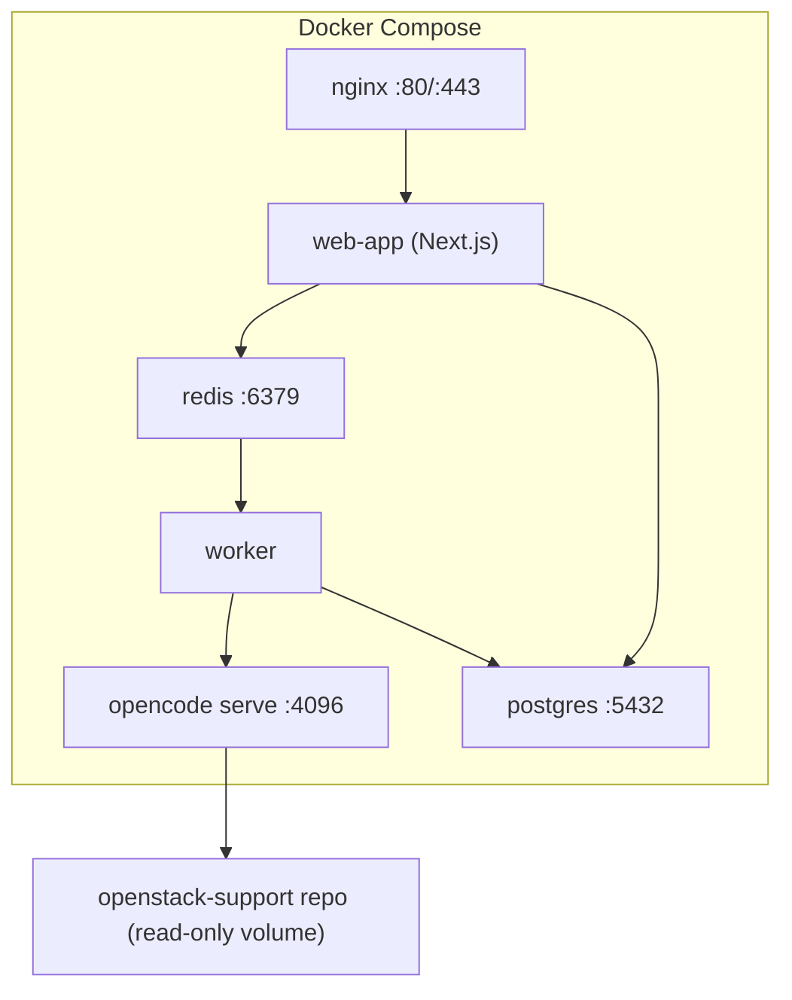
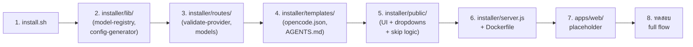

# Web-based GUI Installer สำหรับ chatbot-gate บน Ubuntu 26.04 (v3)

## Background

chatbot-gate เป็น Ops Support Chatbot Platform (NOC / Operation / Admin) deploy บน Ubuntu 26.04 ด้วย Docker Compose + Nginx ใช้ **opencode CLI** เป็น AI engine

**เป้าหมาย**: สร้าง installer แบบ GUI เข้าผ่าน public IP เหมือน WordPress wizard

---

## User Review Required

> [!IMPORTANT]
> **ขอบเขต**: plan นี้ครอบคลุม **ระบบ installer + opencode integration architecture** ยังไม่รวม application UI

> [!WARNING]
> **Target OS**: เฉพาะ Ubuntu 26.04 เท่านั้น

---

## 🔑 Research Findings v3: OpenCode Provider Tiers

จาก research อย่างละเอียดที่ opencode.ai/docs พบว่า opencode มี **3 tier** ของ provider:

### Tier 1: OpenCode Go (สมัครสมาชิก $10/เดือน)

- **ราคา**: $5 เดือนแรก แล้ว $10/เดือน (flat rate)
- **ไม่ต้องมี API key ของ provider อื่น** — ใช้ API key ของ OpenCode Go เอง
- **Models ที่ให้ใช้** (curated, tested by OpenCode team):

| Model | ประเภท | เหมาะกับ |
|---|---|---|
| **GLM-5.2** | Premium | Operation |
| **GLM-5.1** | Premium | Operation |
| **Kimi K2.7 Code** | Code-optimized | NOC, Operation |
| **Kimi K2.6** | General | Operation |
| **DeepSeek V4 Pro** | Premium | Operation |
| **DeepSeek V4 Flash** | Fast, ถูกมาก | NOC, Summarizer |
| **MiniMax M3** | Balanced | NOC |
| **MiniMax M2.7** | Fast | NOC, Summarizer |
| **MiMo-V2.5** | Fast, ถูกสุด | Summarizer |
| **MiMo-V2.5-Pro** | Balanced | NOC |
| **Qwen3.7 Max** | Premium | Operation |
| **Qwen3.7 Plus** | Balanced | NOC |
| **Qwen3.6 Plus** | Balanced | NOC |

- **Usage limits**: $12/5ชม., $30/สัปดาห์, $60/เดือน
- **วิธีสมัคร**: ไปที่ opencode.ai/auth → subscribe Go → copy API key

### Tier 2: OpenCode Zen (จ่ายตามใช้)

- **ราคา**: เติมเครดิต จ่ายตาม request
- **ไม่ต้องมี API key ของ provider อื่น** — ใช้ API key ของ Zen เอง
- **Models**: curated list (เปลี่ยนตาม opencode team update)
- **วิธีสมัคร**: ไปที่ opencode.ai/auth → add billing → copy API key

### Tier 3: Bring Your Own Key (BYOK)

- **ราคา**: จ่ายตรงกับ provider (Google, Anthropic, OpenAI ฯลฯ)
- **ต้องมี API key ของแต่ละ provider**
- **Models**: ใช้ได้ทุก model ของ provider ที่เปิดใช้
- **75+ providers** supported ผ่าน AI SDK + Models.dev

---

## 🔧 Updated Step 5: Provider & Model Settings (SKIPPABLE)

> [!IMPORTANT]
> Step นี้ **ข้ามได้** — ถ้า admin ยังไม่มี API key สามารถกด "ข้ามไปก่อน" แล้วค่อยตั้งค่าทีหลังผ่าน Admin Settings UI

### Step 5A: เลือก Provider

```
┌──────────────────────────────────────────────────────┐
│  🔑  ตั้งค่า AI Provider (ไม่บังคับ — ข้ามได้)       │
│                                                      │
│  เลือกวิธีเชื่อมต่อ AI:                               │
│                                                      │
│  ┌────────────────────────────────────────────────┐  │
│  │ ⭐ OpenCode Go (แนะนำ)                         │  │
│  │    $10/เดือน · ใช้ open models คุณภาพสูง       │  │
│  │    DeepSeek, Kimi, Qwen, GLM, MiniMax         │  │
│  │    สมัครที่ opencode.ai/auth                    │  │
│  │                                                │  │
│  │    API Key: [________________] [ทดสอบ]         │  │
│  └────────────────────────────────────────────────┘  │
│                                                      │
│  ┌────────────────────────────────────────────────┐  │
│  │ 💎 OpenCode Zen (จ่ายตามใช้)                    │  │
│  │    เติมเครดิต · curated models                  │  │
│  │    สมัครที่ opencode.ai/auth                    │  │
│  │                                                │  │
│  │    API Key: [________________] [ทดสอบ]         │  │
│  └────────────────────────────────────────────────┘  │
│                                                      │
│  ┌────────────────────────────────────────────────┐  │
│  │ 🔧 ใช้ API Key ของตัวเอง (BYOK)                │  │
│  │                                                │  │
│  │  ☐ Google (Gemini)                             │  │
│  │    API Key: [________________] [ทดสอบ]         │  │
│  │                                                │  │
│  │  ☐ Anthropic (Claude)                          │  │
│  │    API Key: [________________] [ทดสอบ]         │  │
│  │                                                │  │
│  │  ☐ OpenAI (GPT)                                │  │
│  │    API Key: [________________] [ทดสอบ]         │  │
│  └────────────────────────────────────────────────┘  │
│                                                      │
│  ⓘ สามารถเปิดใช้หลาย provider พร้อมกันได้            │
│  ⓘ API key จะถูกเก็บใน .env ไม่ commit ลง Git        │
│                                                      │
│        [← ย้อนกลับ]  [ข้ามไปก่อน]  [ถัดไป →]         │
└──────────────────────────────────────────────────────┘
```

### Step 5B: เลือก Model (Dropdown — ห้ามพิมพ์เอง)

**แสดง dropdown ตาม provider ที่เลือก**:

```
┌──────────────────────────────────────────────────────┐
│  🤖  เลือก Model สำหรับแต่ละบทบาท                     │
│                                                      │
│  NOC Model (เร็ว, ประหยัด):                           │
│  ┌─────────────────────────────────────┐             │
│  │ ▼ opencode-go/deepseek-v4-flash    │ ← default  │
│  │   opencode-go/deepseek-v4-flash    │             │
│  │   opencode-go/kimi-k2.7-code      │             │
│  │   opencode-go/minimax-m3          │             │
│  │   opencode-go/qwen3.7-plus        │             │
│  │   opencode-go/mimo-v2.5-pro       │             │
│  └─────────────────────────────────────┘             │
│                                                      │
│  Operation Model (ฉลาด, วิเคราะห์ลึก):                │
│  ┌─────────────────────────────────────┐             │
│  │ ▼ opencode-go/kimi-k2.7-code      │ ← default  │
│  │   opencode-go/glm-5.2             │             │
│  │   opencode-go/kimi-k2.7-code      │             │
│  │   opencode-go/deepseek-v4-pro     │             │
│  │   opencode-go/qwen3.7-max         │             │
│  └─────────────────────────────────────┘             │
│                                                      │
│  Close Case Summarizer (สรุปเคส):                     │
│  ┌─────────────────────────────────────┐             │
│  │ ▼ opencode-go/deepseek-v4-flash    │ ← default  │
│  │   opencode-go/deepseek-v4-flash    │             │
│  │   opencode-go/mimo-v2.5           │             │
│  │   opencode-go/minimax-m2.7        │             │
│  └─────────────────────────────────────┘             │
│                                                      │
│  ⓘ แสดงเฉพาะ model จาก provider ที่เปิดใช้แล้ว       │
│  ⓘ ถ้าใช้ BYOK จะเห็น model ของ provider นั้นแทน     │
│                                                      │
│        [← ย้อนกลับ]  [ข้ามไปก่อน]  [ถัดไป →]         │
└──────────────────────────────────────────────────────┘
```

**ถ้าเลือก BYOK + Google เป็น model list นี้แทน:**

| Provider | Model ID | ใช้สำหรับ |
|---|---|---|
| Google | `google/gemini-2.5-flash` | NOC, Summarizer |
| Google | `google/gemini-2.5-pro` | Operation |
| Anthropic | `anthropic/claude-sonnet-4-20250514` | NOC, Operation |
| Anthropic | `anthropic/claude-opus-4-20250514` | Operation |
| Anthropic | `anthropic/claude-haiku-3-5-20241022` | Summarizer |
| OpenAI | `openai/gpt-4o` | Operation |
| OpenAI | `openai/gpt-4o-mini` | NOC, Summarizer |

**ถ้ากด "ข้ามไปก่อน":**
- Installer ยังติดตั้งได้ปกติ
- opencode.json จะ **ไม่ใส่ model** → admin ต้องตั้งค่าทีหลังผ่าน Settings UI
- App จะแสดงหน้า "กรุณาตั้งค่า AI Provider ก่อนใช้งาน" เมื่อ NOC/Op พยายามเปิด chat

---

## 🏗️ Architecture: opencode Integration (ไม่เปลี่ยนจาก v2)

### ใช้ `opencode serve` mode (HTTP server + SDK)



### Agent ไว้ที่ app (gateway agents) → ชี้ไปอ่าน repo knowledge

```
chatbot-gate/.opencode/
├── opencode.json      ← models, agents, permissions (app ควบคุม)
└── AGENTS.md          ← gateway behavior rules

/opt/chatbot-gate/repos/openstack-support/   ← knowledge repo (read-only)
├── knowledge/
├── agents/            ← repo agents (ไม่แตะ)
└── AGENTS.md
```

---

## 📋 Full Wizard Steps Summary

| Step | หัวข้อ | บังคับ? | Default |
|---|---|---|---|
| 1 | Pre-flight Check | ✅ | ตรวจอัตโนมัติ |
| 2 | Database Config | ✅ | สร้าง PostgreSQL ใหม่ |
| 3 | Admin Account | ✅ | username: admin |
| 4 | Knowledge Repo | ✅ | github.com/Natties45/openstack-support |
| 5A | Provider Setup | **ข้ามได้** | OpenCode Go (แนะนำ) |
| 5B | Model Assignment | **ข้ามได้** | deepseek-v4-flash / kimi-k2.7-code |
| 6 | Network & Domain | ✅ | IP Address (HTTP) |
| 7 | Review & Install | ✅ | - |

---

## Proposed Changes (ไม่เปลี่ยนจาก v2 ยกเว้น model-registry)

### [NEW] installer/lib/model-registry.js

Updated เพื่อรองรับ 3 provider tiers:

```javascript
const MODEL_REGISTRY = {
  "opencode-go": {
    name: "OpenCode Go",
    description: "$10/เดือน · Open models คุณภาพสูง",
    requiresKey: true, // API key จาก opencode.ai/auth
    envVar: "OPENCODE_GO_API_KEY",
    models: [
      { id: "opencode-go/glm-5.2", name: "GLM-5.2", tier: "premium" },
      { id: "opencode-go/glm-5.1", name: "GLM-5.1", tier: "premium" },
      { id: "opencode-go/kimi-k2.7-code", name: "Kimi K2.7 Code", tier: "premium" },
      { id: "opencode-go/kimi-k2.6", name: "Kimi K2.6", tier: "balanced" },
      { id: "opencode-go/deepseek-v4-pro", name: "DeepSeek V4 Pro", tier: "premium" },
      { id: "opencode-go/deepseek-v4-flash", name: "DeepSeek V4 Flash", tier: "fast" },
      { id: "opencode-go/minimax-m3", name: "MiniMax M3", tier: "balanced" },
      { id: "opencode-go/minimax-m2.7", name: "MiniMax M2.7", tier: "fast" },
      { id: "opencode-go/mimo-v2.5", name: "MiMo-V2.5", tier: "fast" },
      { id: "opencode-go/mimo-v2.5-pro", name: "MiMo-V2.5-Pro", tier: "balanced" },
      { id: "opencode-go/qwen3.7-max", name: "Qwen3.7 Max", tier: "premium" },
      { id: "opencode-go/qwen3.7-plus", name: "Qwen3.7 Plus", tier: "balanced" },
      { id: "opencode-go/qwen3.6-plus", name: "Qwen3.6 Plus", tier: "balanced" },
    ],
    defaults: {
      noc: "opencode-go/deepseek-v4-flash",
      operation: "opencode-go/kimi-k2.7-code",
      summarizer: "opencode-go/deepseek-v4-flash",
    }
  },
  "opencode-zen": {
    name: "OpenCode Zen",
    description: "จ่ายตามใช้ · Curated models",
    requiresKey: true,
    envVar: "OPENCODE_ZEN_API_KEY",
    models: [], // populated dynamically from Zen API
    defaults: { noc: null, operation: null, summarizer: null }
  },
  "google": {
    name: "Google (Gemini)",
    envVar: "GOOGLE_API_KEY",
    models: [
      { id: "google/gemini-2.5-flash", tier: "fast" },
      { id: "google/gemini-2.5-pro", tier: "premium" },
    ],
    defaults: {
      noc: "google/gemini-2.5-flash",
      operation: "google/gemini-2.5-pro",
      summarizer: "google/gemini-2.5-flash",
    }
  },
  "anthropic": { /* ... Claude models ... */ },
  "openai": { /* ... GPT models ... */ },
};
```

---

## Open Questions

> [!IMPORTANT]
> **1. Domain/HTTPS**: ใช้ domain name + HTTPS ตั้งแต่ install หรือใช้ IP ก่อน?

> [!IMPORTANT]
> **2. GitHub repo access**: repo `openstack-support` เป็น public หรือ private?

---

## Verification Plan

### Automated Tests
```bash
cd installer && npm test
node lib/model-registry.js --list
node lib/config-generator.js --dry-run
```

### Manual Verification
1. Clone repo บน Ubuntu 26.04
2. รัน `sudo bash install.sh`
3. เปิด `http://<server-ip>:9090`
4. ทดสอบ **กด "ข้ามไปก่อน"** ที่ Step 5 → ติดตั้งได้ปกติ
5. ทดสอบ **เลือก OpenCode Go** + model dropdown → config ถูกต้อง
6. ทดสอบ **เลือก BYOK + Google** → model dropdown เปลี่ยนเป็น Gemini
7. ตรวจว่า 6 containers ขึ้นครบ
8. ตรวจว่า installer ปิดตัวเอง

---

## Execution Order


