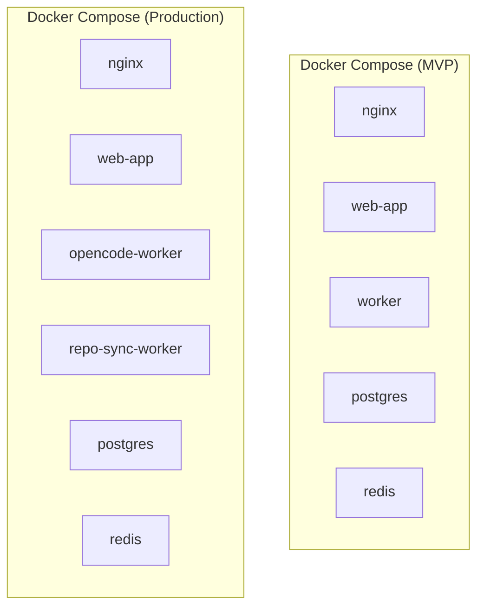
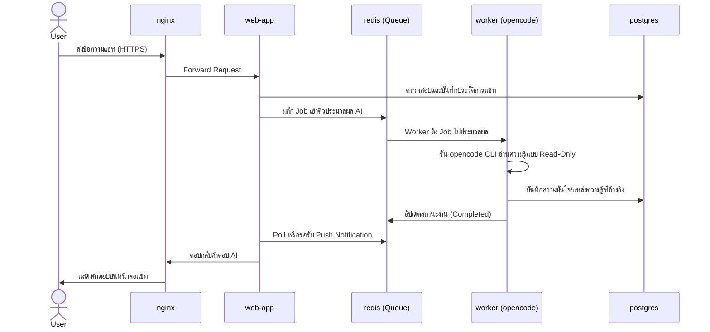
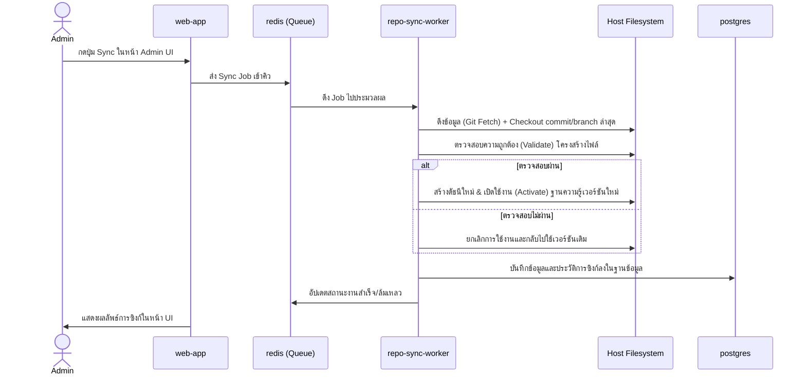
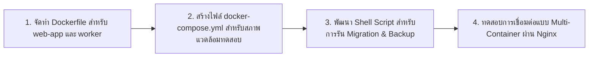

# Infrastructure Container Plan

## Background

chatbot-gate ได้รับการออกแบบให้ทำงานบนระบบปฏิบัติการ Ubuntu 26.04 โดยใช้ Docker Compose เป็น Container Runtime
เอกสารนี้กำหนดโครงสร้างและสถาปัตยกรรมระดับ Infrastructure (Container Layout), การจัดสรรหน้าที่ของแต่ละ Service, การเชื่อมโยงข้อมูลผ่าน Shared Volumes, เส้นทางการรับส่ง Request (Flow) ตลอดจนการรักษาความปลอดภัย (Security) และการวางแผนขยายระบบจากเวอร์ชัน MVP ไปสู่ Production

---

## User Review Required

> [!IMPORTANT]
> **การแบ่งระยะพัฒนา (Phasing)**: ในระยะ MVP (Phase 1) ระบบจะใช้งาน Container `worker` ตัวเดียวรับหน้าที่ทั้งการประมวลผล AI (`opencode`) และการซิงก์ Git Repo เพื่อลดความซับซ้อน แต่ในระยะ Production (Phase 2) จะต้องทำการแยกออกเป็น 2 worker อิสระ (`opencode-worker` และ `repo-sync-worker`) เพื่อเพิ่มเสถียรภาพและป้องกันการล่มของระบบ

> [!WARNING]
> **สิทธิ์ของ Shared Volumes**: 
> - `repo-sync-worker` ต้องได้รับสิทธิ์ **Read/Write** บน Knowledge Volume เพื่อดึงการอัปเดตจาก GitHub
> - `opencode-worker` ต้องได้รับสิทธิ์เพียง **Read-Only** เพื่อความปลอดภัย ป้องกันไม่ให้โมเดล AI เขียนหรือแก้ไขข้อมูลในฐานความรู้โดยตรง

---

## Core Container Architecture

### Container Layout



| Service | หน้าที่หลัก | MVP (Phase 1) | Production (Phase 2) |
|---|---|---|---|
| **nginx** | Reverse Proxy, SSL termination, Access/Error logs | ✅ | ✅ |
| **web-app** | Next.js Frontend/Backend, Auth, API, Chat/Admin UI | ✅ | ✅ |
| **worker** | ประมวลผล AI + ซิงก์ Git (รวมหน้าที่ชั่วคราว) | ✅ | ❌ (แยกออกเป็น 2 worker ด้านล่าง) |
| **opencode-worker** | ประมวลผล `opencode` CLI (สิทธิ์ Read-Only บน KB) | ❌ | ✅ |
| **repo-sync-worker**| ซิงก์ Git, ตรวจสอบ (Validate), reload KB index | ❌ | ✅ |
| **postgres** | เก็บข้อมูลถาวร (User, Logs, Sessions, Metadata) | ✅ | ✅ |
| **redis** | Queue & Task Manager สำหรับการประสานงาน AI/Sync | ✅ | ✅ |

---

### Service Responsibilities

#### 1. nginx
- ทำหน้าที่เป็นด่านหน้ารับ Traffic และทำ Reverse Proxy ไปยัง `web-app`
- จัดการใบรับรองความปลอดภัย HTTPS (SSL)
- แยก Access Log และ Error Log เพื่อการตรวจสอบและมอนิเตอร์ระดับนอกสุด

#### 2. web-app (Next.js)
- จัดการหน้าเว็บ (Frontend) และ API Backend สำหรับ Login, Role Policy, Chat UI, Admin UI
- รับคำขอและสร้าง Background Jobs ส่งไปที่ Redis Queue (ไม่เรียกใช้ `opencode` หรือรันงาน Git Sync โดยตรงผ่าน HTTP Request)

#### 3. worker / opencode-worker
- ทำงานกับระบบ AI ผ่าน `opencode` CLI
- อ่านฐานข้อมูลความรู้จากโฟลเดอร์ของ Repository `openstack-support` ที่ mount เข้ามา
- ควบคุมสิทธิ์ของ AI Agent ตามข้อกำหนดสิทธิ์ (Role Policy) ที่ได้ส่งผ่านมาจาก Backend

#### 4. repo-sync-worker
- จัดการงาน Background ของ Git: `git fetch`, checkout commit ที่ต้องการ
- ทำการตรวจสอบความถูกต้อง (Validate) ของโครงสร้างไฟล์ใน repository ก่อนการเปิดใช้งานจริง (Activate) เพื่อให้มั่นใจว่าจะไม่มีผลกระทบต่อบอท
- จัดเก็บ Sync Audit Log และสร้าง Index ความรู้ใหม่

#### 5. postgres
- ฐานข้อมูลหลักของระบบ เก็บข้อมูล User, Role, Chat Sessions, Message Logs, Audit Logs และสถานะเวอร์ชันของ Repository ปัจจุบัน

#### 6. redis
- ทำงานร่วมกับ Queue Manager สำหรับรอคิวประมวลผลงานหนัก เช่น การแชทกับ AI (opencode jobs) และการซิงก์ความรู้ (sync jobs)

---

## Storage & Shared Volumes

โฟลเดอร์บน Host OS ที่ต้อง Mount เข้าไปในแต่ละ Container:

1. `/opt/chatbot-gate/data` -> สำหรับ PostgreSQL data, backups, และ App state 
2. `/opt/chatbot-gate/repos/openstack-support` -> โฟลเดอร์เก็บ Repository ของฐานความรู้ (Knowledge Source-of-Truth)
3. `/opt/chatbot-gate/logs` -> สำหรับจัดเก็บ Service logs ที่ต้องคงอยู่แม้ container จะถูกลบหรือรีสตาร์ท

---

## Request & Sync Flows

### 1. Request Flow (การทำงานของแชท)



### 2. Admin Sync Flow (การอัปเดตความรู้)



---

## Security & Operations

1. **Database Migrations**: ต้องเตรียม Script รันการทำ database migration (เช่น Prisma/Drizzle) ในขั้นตอนการ Boot Container ของ `web-app` (หรือใช้ Init Container) เพื่อสร้าง/อัปเดต Schema ตารางฐานข้อมูลโดยอัตโนมัติ
2. **Secrets Management**: ห้ามเก็บ Credentials ต่างๆ ในโค้ด ให้จัดการผ่านไฟล์ `.env` ที่ไม่อยู่ในการติดตามของ Git หรือใช้งาน Docker Secrets บน Production
3. **Volume Permissions**: บังคับใช้นโยบายสิทธิ์แบบจำกัดขั้นต่ำ (Least Privilege) โดย Mount volume ฐานความรู้เป็น `Read-Only` ใน Container ของ `opencode-worker`
4. **Data Backups**: ตั้งค่า Container เพิ่มเติมสำหรับการรัน Cron job เพื่อรันคำสั่ง `pg_dump` สำรองข้อมูลของ PostgreSQL ลงในโฟลเดอร์ `/opt/chatbot-gate/data/backups` อย่างสม่ำเสมอ
5. **Monorepo Build**: เนื่องจากใช้ Monorepo การกำหนด Dockerfile ต้องคัดลอกไฟล์โดยอ้างอิง Root Workspace เพื่อให้สามารถ Build package ร่วมกันได้ครบถ้วน

---

## Open Questions

> [!IMPORTANT]
> **การสำรองข้อมูล (Backup Schedule)**: จำเป็นต้องตั้งค่าความถี่ในการทำสำรองข้อมูลฐานข้อมูล PostgreSQL ถี่แค่ไหน (เช่น ทุกเที่ยงคืน หรือทุกๆ 6 ชั่วโมง)?

---

## Verification Plan

### Automated Tests
- ตรวจสอบความถูกต้องทางไวยากรณ์ (Syntax) ของ Docker Compose Configuration:
```bash
docker compose config
```

### Manual Verification
1. สั่งรันคำสั่งรันระบบใน Phase 1: `docker compose up -d`
2. ตรวจสอบสถานะการทำงานของ Container ทั้งหมด: `docker compose ps`
3. ตรวจสอบสิทธิ์การเข้าถึงโฟลเดอร์ Repository บน Container โดยการลองสร้างไฟล์เทสในโฟลเดอร์ `/opt/chatbot-gate/repos/openstack-support` ผ่าน `opencode-worker` (ระบบต้องแจ้งเตือนปฏิเสธสิทธิ์ Read-Only)
4. ทดสอบความทนทานต่อความผิดพลาดโดยสั่งหยุด (Stop) คอนเทนเนอร์ `worker` ขณะที่มีการแชท แล้วตรวจสอบการจัดเก็บคิวใน `redis`

---

## Execution Order


