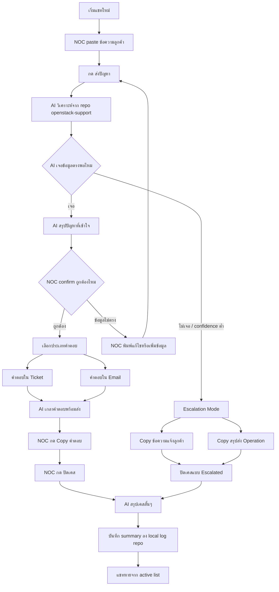
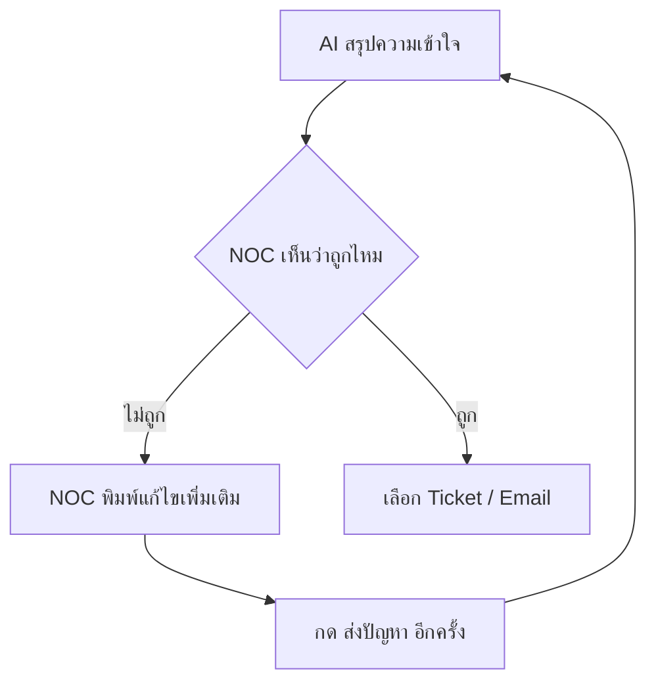
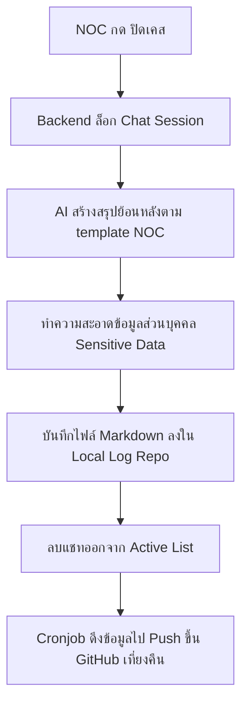
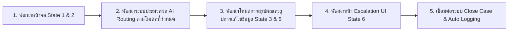

# NOC Chat UX Flow

## Background

NOC (Network Operations Center) ใช้งานระบบนี้เป็นเครื่องมือสนับสนุนสำหรับตอบคำถามและแก้ไขปัญหาประเภทคำขอร้อง (Request) ของลูกค้าทั่วไป โดยตัวระบบจะดึงข้อมูลความรู้จาก Git repository `openstack-support` เป็นหลัก (ประมาณ 90% ของกรณีทั้งหมด) และจะหลีกเลี่ยงการค้นหาข้อมูลภายนอก (Web search) โดยค่าเริ่มต้น
เอกสารฉบับนี้มีวัตถุประสงค์เพื่อกำหนดเส้นทางประสบการณ์ผู้ใช้ (UX Flow) รวมถึงการกำหนดสถานะการแสดงผลของหน้าจอ (Page States) ของระบบแชท NOC ให้มีขั้นตอนที่ชัดเจน รวดเร็ว และไม่ต้องอาศัยความรู้ด้านเทคนิคเกี่ยวกับ AI Engine หรือ Command-line

---

## User Review Required

> [!IMPORTANT]
> **ระบบการปิดเคส (Close Case Mechanism)**: ในระหว่างการสนทนา บัญชีผู้ใช้ประเภท NOC จะทำงานอยู่ภายใต้ **Plan Mode (Read-Only)** เสมอ (ไม่มีสิทธิ์รันคำสั่ง Shell หรือแก้ไขไฟล์ใดๆ) แต่เมื่อ NOC กดปุ่ม `ปิดเคส` ตัวระบบ API Backend จะทำการล็อกการสนทนาและเรียกรันงาน Background Job พิเศษ (`close-case job`) เพื่อทำการสรุปบทสนทนาและบันทึกลงใน Local Log Repo ในรูปแบบ **Build Mode** ที่ถูกจำกัดสิทธิ์เฉพาะโฟลเดอร์ Log เท่านั้น

> [!WARNING]
> **การควบคุมสิทธิ์อย่างเข้มงวด**: ห้ามอ้างอิงข้อมูลของ NOC Case ไปเขียนบันทึกลงใน Repository หลักอย่าง `openstack-support` โดยเด็ดขาด เพื่อป้องกันความปลอดภัยของข้อมูลความรู้หลัก

---

## Core UX Flow

เพื่อให้เจ้าหน้าที่ NOC สามารถปฏิบัติงานได้อย่างรวดเร็วและเป็นขั้นเป็นตอน จึงกำหนด Flow หลักไว้ดังนี้:



---

## Page States Detail

### State 1: New Chat (เริ่มบทสนทนา)
หน้าจอสำหรับพิมพ์หรือวางรายละเอียดข้อความของลูกค้า เพื่อป้องกันไม่ให้เจ้าหน้าที่สับสน หน้าจอเริ่มแรกจะมีเพียงองค์ประกอบเดียว:
- **UI Elements**: กล่องป้อนข้อความขนาดใหญ่ (Textarea) และปุ่ม `ส่งปัญหา`
- *หมายเหตุ*: เจ้าหน้าที่ไม่ต้องทำการเลือกประเภท Agent, Model หรือหมวดหมู่คำถามเอง ระบบหลังบ้านจะเป็นผู้ประมวลผลให้

### State 2: AI Understanding (สรุปความเข้าใจของระบบ)
หลังจากกดส่งข้อมูล ระบบจะนำเสนอความเข้าใจของ AI ต่อปัญหานั้นๆ ก่อนการร่างคำตอบจริง:
- **UI Elements**: ข้อความสรุปความเข้าใจของปัญหา, หมวดหมู่ปัญหาที่ตรวจพบ, แหล่งอ้างอิงไฟล์ความรู้ที่พบ และระดับความเชื่อมั่น (Confidence: High/Medium/Low)
- **Actions**: ปุ่ม [ถูกต้อง] และ [ข้อมูลไม่ตรง]

### State 3: Choose Response Type (เลือกรูปแบบคำตอบ)
เมื่อเจ้าหน้าที่กดยืนยันความถูกต้องในขั้นตอนที่ 2 แล้ว ระบบจะแสดงรูปแบบของคำตอบให้เลือก:
- **Actions**:
  - `คำตอบใน Ticket`: สำหรับตอบกลับในระบบแชทหรือระบบทิกเก็ต (ข้อความสั้น กระชับ ตรงประเด็น)
  - `คำตอบใน Email`: สำหรับใช้ตอบกลับทางอีเมล (มีความเป็นทางการ นุ่มนวล มีคำเกริ่นนำและสรุปท้าย)

### State 4: Generated Reply & Case Close (แสดงผลลัพธ์และปิดเคส)
หน้าจอแสดงร่างข้อความคำตอบที่พร้อมคัดลอกไปใช้งาน:
- **UI Elements**: กล่องข้อความผลลัพธ์แบบ Read-only
- **Actions**: 
  - ปุ่ม `Copy คำตอบ` (คัดลอกเฉพาะคำตอบสำหรับส่งให้ลูกค้าเท่านั้น ไม่รวมสรุปภายในระบบ)
  - ปุ่ม `ปิดเคส` (ล้างสถานะแชท สั่งประมวลผลบันทึก และนำออกจากรายการ Active)

### State 5: Information Mismatch Loop (กรณีตีความผิดพลาด)
หากเจ้าหน้าที่กดปุ่ม `ข้อมูลไม่ตรง` ในขั้นตอนที่ 2 ระบบจะเปิดช่องให้ระบุข้อมูลที่ถูกต้องเพิ่มเติม:
- **UI Elements**: กล่องป้อนข้อความสำหรับระบุข้อผิดพลาดหรือเพิ่มบริบท
- **Actions**: ปุ่ม `ส่งปัญหา` เพื่อกลับไปวิเคราะห์ใหม่อีกครั้งตามลูปด้านล่าง



### State 6: Escalation Mode (การส่งต่อเคส)
หากระดับความเชื่อมั่นของ AI ต่ำเกินไป หรือไม่พบข้อมูลความรู้ใน Repository ระบบจะไม่แต่งคำตอบเองแต่จะเข้าสู่โหมดส่งต่อ:
- **UI Elements**: ข้อความแจ้งเตือน "ไม่พบข้อมูลที่ตรงพอในระบบฐานความรู้ แนะนำให้ส่งเรื่องต่อไปยัง Operation"
- **Actions**: 
  - ปุ่ม `Copy ข้อความแจ้งลูกค้า` (รับเรื่องประสานงานต่อ)
  - ปุ่ม `Copy สรุปส่ง Operation` (สร้างสรุปรายละเอียดเคสและสาเหตุเพื่อส่งต่อให้ทีม Op)
  - ปุ่ม `ปิดเคสแบบ Escalated`

---

## Close Case Flow & Logging



### ตัวอย่างการบันทึกสรุปเคส (Case Summary Template)

เมื่อทำการปิดเคส ระบบจะสร้างไฟล์ `.md` จัดเก็บใน Log Repository ดังตัวอย่าง:

```markdown
# NOC Case Summary

Date: 2026-06-26
Status: resolved
Category: Domain / Request
Confidence: High
Response Type: Ticket

## Customer Request Summary
ลูกค้าสอบถามวิธีต่ออายุโดเมนผ่านระบบ Gate

## AI Understanding
เป็น request เกี่ยวกับการต่ออายุโดเมน ไม่ใช่ incident

## Final Action
NOC ใช้คำตอบแบบ Ticket และปิดเคสหลัง copy คำตอบ

## Knowledge Sources
- knowledge/domain.yaml

## Improvement Note
ไม่มี
```

---

## Open Questions

> [!IMPORTANT]
> **การแก้ไขข้อความร่าง**: ควรยินยอมให้เจ้าหน้าที่ NOC สามารถแก้ไขข้อความที่ AI ร่างขึ้นมาโดยตรงบนหน้าจอเบราว์เซอร์ได้ก่อนที่จะกดคัดลอก (Copy) หรือไม่ หรือต้องการให้เป็นกล่องข้อความแบบ Read-Only เสมอเพื่อบังคับมาตรฐานคำตอบ?

---

## Verification Plan

### Manual Verification
1. ทดสอบการจำลองส่งข้อความแชทในบทบาท NOC และตรวจสอบว่า UI ล็อกไม่ให้เปิดใช้แท็บอื่นหรือแก้ไขค่าโมเดล
2. ทดสอบขั้นตอนการกดปุ่ม `ข้อมูลไม่ตรง` เพื่อดูว่าระบบทำการส่งคำวิเคราะห์ใหม่ได้อย่างถูกต้อง
3. ตรวจสอบการทำความสะอาดข้อมูลส่วนตัว (เช่น อีเมล, รหัสผ่าน หรือ API key) ในข้อมูลสรุปเคส Markdown ก่อนที่จะจัดเก็บบันทึกลงในแฟ้มประวัติ

---

## Execution Order


