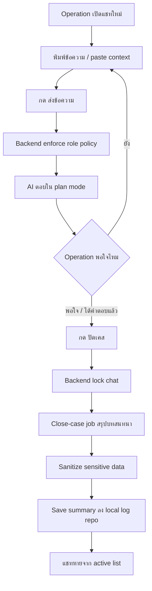
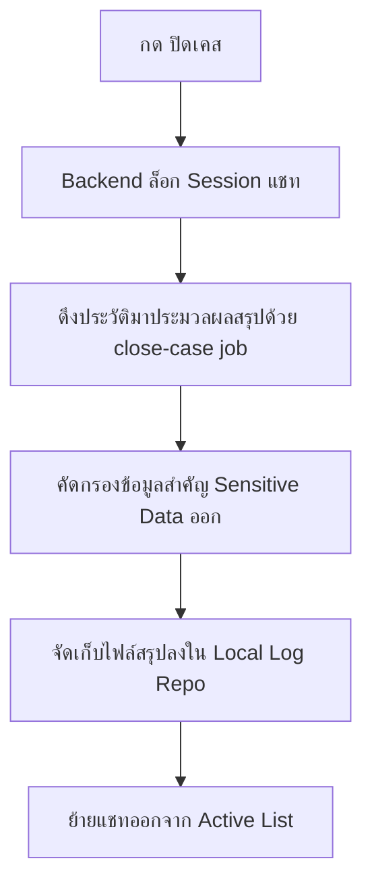
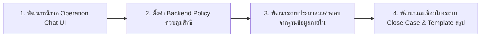

# Operation Chat UX Flow

## Background

ทีม Operation (ปฏิบัติการ) จำเป็นต้องใช้งานระบบแชทนี้สำหรับการสอบถามข้อมูลเชิงลึก ค้นหาสาเหตุของ Incident ที่ซับซ้อน ร่างคำตอบหรือโน้ตสรุปสำหรับเคสที่ยากเกินกว่าระดับที่ NOC จะตอบได้
เอกสารฉบับนี้กำหนดรูปแบบและสถาปัตยกรรมของหน้าจอสำหรับทีม Operation ซึ่งมีลักษณะเป็นบทสนทนาแบบเสรี (Free Chat) ภายใต้ขอบเขตความปลอดภัยและการจำกัดสิทธิ์โดยระบบหลังบ้าน เพื่อให้เจ้าหน้าที่สามารถนำเอาความรู้ภายในมาวิเคราะห์ปัญหาได้อย่างปลอดภัย

---

## User Review Required

> [!IMPORTANT]
> **การบังคับใช้สิทธิ์การรันคำสั่ง (Role Enforcement)**: ระบบหลังบ้านจะทำการบล็อกสิทธิ์การรันคำสั่ง Shell (`bash = deny`) และสิทธิ์การแก้ไขไฟล์ (`edit/write = deny`) สำหรับสิทธิ์ระดับ Operation เสมอ โดยการคุยจะทำงานในโหมด **Plan Mode** เท่านั้น ซึ่งเป็นส่วนที่บังคับจากระดับ API เพื่อป้องกันความเสียหายของระบบ

> [!WARNING]
> **การแยกความแตกต่างจาก NOC**: หน้าจอของ Operation จะไม่มีลำดับขั้นตอนบังคับ (Workflow) เหมือน NOC (ไม่มีขั้นตอนยืนยันความเข้าใจ หรือเลือกช่องทาง Ticket/Email) โดยมีโครงสร้างการคุยคล้ายแชททั่วไป

---

## Core UX Flow

เส้นทางการสนทนาของ Operation เน้นความเป็นอิสระในการวิเคราะห์ข้อมูลความรู้:



---

## Page Layout & Interface

หน้าจอแชทสำหรับทีม Operation เน้นความเรียบง่าย ไม่มีความยุ่งยากในการใช้งาน:
- **UI Elements**: 
  - พื้นที่แสดงประวัติการสนทนาย้อนหลัง (Conversation History)
  - กล่องข้อความสำหรับป้อนคำถาม (Textarea)
  - ปุ่ม `ส่งข้อความ` และปุ่ม `ปิดเคส` (วางอยู่ด้านล่างสุดเมื่อประมวลผลคำตอบเสร็จสิ้น)
- **ฟังก์ชันที่ยกเว้น (ไม่มีในหน้าจอนี้)**: ปุ่มวิเคราะห์เคส, ยืนยันความเข้าใจ, เลือกช่องทางการตอบ, คัดลอกแยกประเภท หรือหน้าจัดการโมเดล AI/Agent

---

## Backend Role Enforcement

การป้องกันและจำกัดสิทธิ์การทำงานของ Agent สำหรับบัญชีผู้ใช้ระดับ Operation จะถูกควบคุมจากระดับ Backend Policy อย่างเข้มงวด:

- **Agent**: ถูกกำหนดให้ใช้ `operation-agent` 
- **Mode**: บังคับให้เป็น `plan` / `read-only` เสมอ
- **Bash Command & File System**: `deny` (ไม่อนุญาตให้รันคำสั่ง terminal หรือทำการแก้ไข/สร้างไฟล์)
- **Web Search**: ถูกปิดการใช้งานโดยค่าเริ่มต้น (ยกเว้นผู้ดูแลระบบจะอนุญาตเป็นรายกรณี)

---

## Close Case Flow & Logging

การปิดเคสใช้ระบบเบื้องหลังเดียวกันกับระบบ NOC (เรียกรัน `close-case job` ในลักษณะ Background Task):



### ตัวอย่างการบันทึกสรุปเคส (Case Summary Template)

เมื่อปิดเคสสำเร็จ ระบบจะแยกประเภทไฟล์สรุปออกตามประเด็นการสนทนา เช่น:

```markdown
# Operation Case Summary

Date: 2026-06-26
Status: resolved
Category: General / Analysis / Incident
Confidence: Medium
Source: free chat

## Conversation Topics
สรุปหัวข้อประเด็นปัญหาที่พิจารณาในการสนทนานี้

## Key Insights
สิ่งที่ทีม Operation สอบถามและแนวทางวิเคราะห์ที่ระบบ AI แนะนำ

## Action Items
สิ่งที่เป็นแนวทางปฏิบัติหรือขั้นตอนที่ผู้ใช้ควรทำต่อ

## Knowledge Sources
- knowledge/runbook.yaml

## Knowledge Gap
ไม่มี
```

---

## Open Questions

> [!IMPORTANT]
> **การสืบค้นข้อมูลเว็บภายนอก (Web Search Tool)**: ทีม Operation ควรได้รับอนุญาตให้ใช้ความสามารถในการค้นหาอินเทอร์เน็ตเพิ่มเติมหรือไม่ เพื่อช่วยในการหาวิธีแก้ปัญหาของเทคโนโลยีภายนอกที่ไม่ได้อยู่ใน repository ท้องถิ่น?

---

## Verification Plan

### Manual Verification
1. ทดสอบสร้าง session แชทด้วยบัญชีผู้ใช้ระดับ Operation
2. ป้อนข้อความทดสอบลองสั่งแก้ไฟล์ หรือป้อนคำสั่ง shell (เช่น `cat` หรือ `ls`) เพื่อตรวจสอบว่าระบบ Backend สามารถสกัดกั้นการรันคำสั่งได้จริง
3. ทดสอบการกดปุ่ม `ปิดเคส` และตรวจสอบไฟล์ Markdown สรุปผลว่ามีการนำข้อมูลส่วนตัวหรือความลับออก และถูกบันทึกลงใน Log repo อย่างสมบูรณ์

---

## Execution Order


