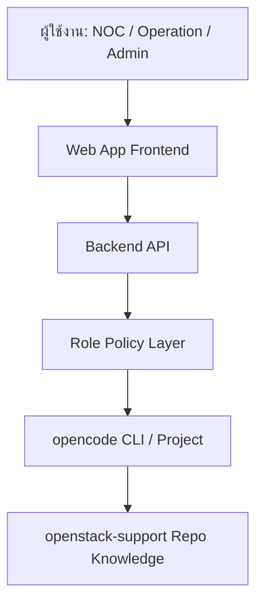
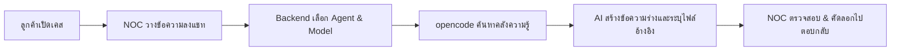
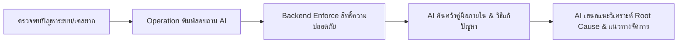
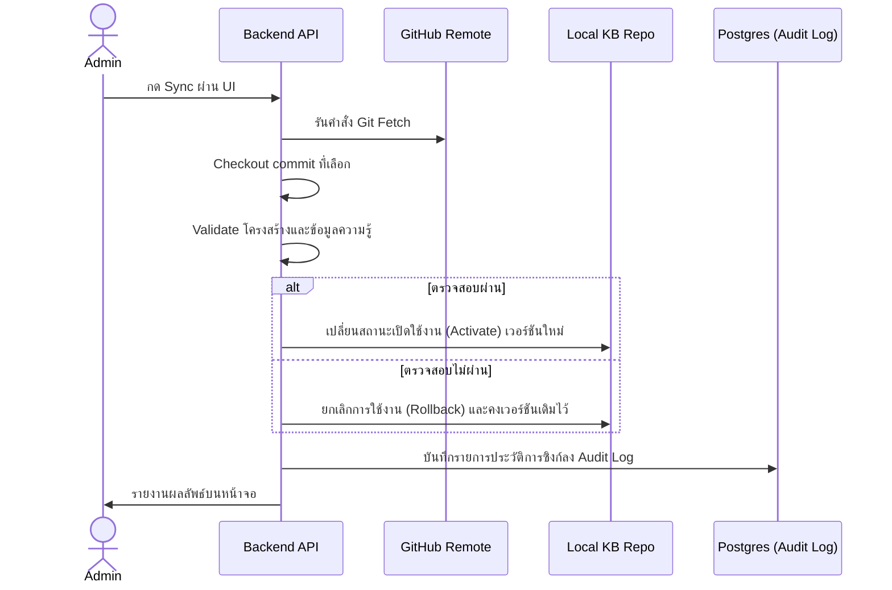
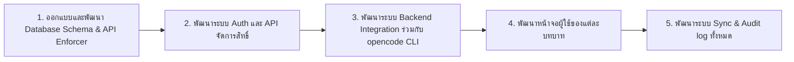

# Ops Support Platform Plan

## Background

chatbot-gate คือ Web Application Platform ที่พัฒนาขึ้นเพื่ออำนวยความสะดวกในการใช้งานระบบ AI Engine `opencode` สำหรับผู้ใช้ในบทบาทต่างๆ ได้แก่ NOC, Operation และ Admin โดยที่ผู้ใช้งานไม่จำเป็นต้องพิมพ์คำสั่งผ่าน CLI (Command Line Interface) โดยตรง
ระบบนี้จะช่วยในกระบวนการร่างคำตอบส่งให้ลูกค้า, การสืบค้นเอกสารคู่มือ (Knowledge), การเกลาภาษาการสื่อสาร, การจำกัดขอบเขตสิทธิ์ตามบทบาทหน้าที่ (Role Enforcement) และการดึงข้อมูลเพื่อปรับปรุงข้อมูลความรู้จาก Git repository `openstack-support`

---

## User Review Required

> [!IMPORTANT]
> **ระบบล็อกสิทธิ์สองชั้น (Dual-Lock Role Enforcement)**: เพื่อความปลอดภัยสูงสุด ระบบจะควบคุมสิทธิ์โดยไม่พึ่งพาระบบ Prompt ของ AI เพียงอย่างเดียว แต่จะใช้การบังคับสิทธิ์ 2 ระดับ:
> 1. **Backend API Policy**: ตรวจสอบ Role ของผู้ใช้จาก Backend, บังคับเลือก Agent, บังคับ Model และจำกัดเครื่องมือที่เรียกใช้งาน
> 2. **opencode Configuration**: สั่งปฏิเสธคำสั่งระบบไฟล์ (`bash / write = deny`) สำหรับ NOC และ Operation

> [!WARNING]
> **แหล่งข้อมูลอ้างอิงความรู้ (Source of Truth)**: เอกสารคู่มือและโครงสร้างการทำงานทั้งหมดจะอ้างอิงจาก Repository `https://github.com/Natties45/openstack-support.git` เป็นหลักเท่านั้น การแก้ไขใดๆ จะเกิดขึ้นผ่านการจัดการแบบ Git Version Control

---

## Platform Architecture

ระบบจัดแบ่งโครงสร้างการส่งผ่านข้อมูลออกเป็นลำดับชั้นดังนี้:

---

## User Roles & System Permissions

| บทบาท (Role) | สิทธิ์การเข้าถึง | การทำงานของ AI Agent | ขอบเขตการทำงาน |
|---|---|---|---|
| **NOC** | เข้าถึงหน้า Chat ได้อย่างเดียว | บังคับใช้ Agent และ Model เฉพาะ (fast model) | Read-only / Plan mode (ห้ามรัน CLI, ห้ามเขียนไฟล์, อ้างอิงเฉพาะคู่มือความรู้ที่ซิงก์มา) |
| **Operation** | เข้าถึงหน้า Chat เชิงลึก | เข้าถึง Agent เฉพาะด้านและข้อมูล Internal KB | Read-only / Plan mode (วิเคราะห์ปัญหาหลัก/ผลกระทบ แต่ไม่อนุญาตให้แก้ไฟล์ในระบบ) |
| **Admin** | เข้าถึงระบบควบคุมและตั้งค่าทั้งหมด | สามารถควบคุมระบบผ่าน UI ได้โดยตรง | สิทธิ์การจัดการ User, จัดการสิทธิ์การเข้าถึง, ซิงก์ Repository, และตรวจสอบประวัติ Audit Log |

---

## Core Workflows

### 1. NOC Support Flow
กระบวนการร่างคำตอบและวิเคราะห์ปัญหาลูกค้าเบื้องต้น:

### 2. Operation Analysis Flow
กระบวนการสอบถามข้อมูลเพื่อวิเคราะห์ปัญหาเชิงลึก:

### 3. Admin Sync Flow (Controlled Sync)
ระบบการดึงข้อมูลความรู้เวอร์ชันใหม่จากระยะไกล:

---

## MVP Scope (ขอบเขตระยะเริ่มต้น)

### สิ่งที่จะมีใน Phase 1 (MVP)
- ระบบล็อกอินและยืนยันตัวตนแบบง่าย (Simple Auth)
- ระบบจัดสรรสิทธิ์ผู้ใช้: NOC, Operation และ Admin
- หน้าจอแชทสำหรับเจ้าหน้าที่ NOC (มี workflow คัดกรองชัดเจน)
- หน้าจอแชทสำหรับเจ้าหน้าที่ Operation ในรูปแบบ Read-only Free Chat
- หน้าจอสำหรับ Admin ในการควบคุมและสั่งซิงก์ข้อมูล Git Repository
- ระบบจัดเก็บ Audit Log พื้นฐาน
- การควบคุม Agent/Model/Mode จากระบบหลังบ้าน

### สิ่งที่ยังไม่มีใน Phase 1 (เลื่อนไปพัฒนาระยะถัดไป)
- การยินยอมให้เขียนไฟล์หรือสั่งรันคำสั่งโดยตรงบนระบบ Production
- ระบบการขออนุมัติการแก้ไขเอกสารผ่านหน้าเว็บ (Approval Workflow)
- การเชื่อมโยงข้อมูลกับระบบทิกเก็ตลูกค้าภายนอก (Ticket Integration)

---

## Open Questions

> [!IMPORTANT]
> **ระบบการแจ้งเตือน (Notifications)**: จำเป็นต้องพัฒนาระบบแจ้งเตือนผู้ดูแลระบบ (Admin) ผ่านแอปพลิเคชันสื่อสารภายนอก เช่น Slack หรือ Microsoft Teams เมื่อกระบวนการซิงก์ Repository ล้มเหลว (Sync Failed) ในระยะ MVP นี้หรือไม่?

---

## Verification Plan

### Manual Verification
1. ล็อกอินด้วยผู้ใช้ NOC และจำลองการแชท ตรวจสอบว่า API ส่งคำขอเฉพาะ `noc-agent` และมีค่า `plan` mode เท่านั้น
2. ล็อกอินด้วยผู้ใช้ Admin และเข้าเมนูตั้งค่า ทดลองทำการใส่ URL ของ Git Repository ที่ไม่มีอยู่จริงหรือเป็นส่วนตัว เพื่อทดสอบการ Validation และการสร้างข้อความแสดงข้อผิดพลาดบนหน้าจอ
3. ลองทำกระบวนการซิงก์ให้ล้มเหลว (เช่น นำไฟล์ไวยากรณ์ผิดพลาดใส่ใน repo) แล้วตรวจสอบว่าข้อมูลในฐานระบบย้อนกลับเป็นสถานะเดิม (Rollback) โดยอัตโนมัติ

---

## Execution Order

