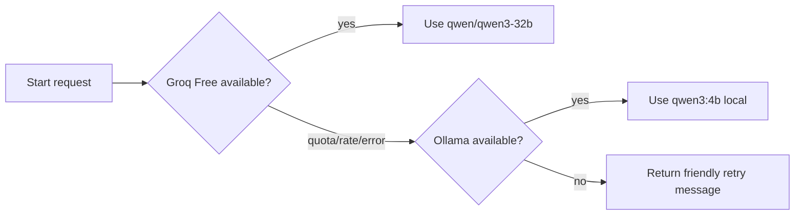

# Fallback Design — app2 v2.0.0

> Goal: keep app2 usable with free services and no GPU, while making quota failures predictable.

---

## Provider Order



---

## Primary Provider

| Field | Value |
|-------|-------|
| Provider | Groq Free |
| Model | `qwen/qwen3-32b` |
| Strength | Fast hosted inference, no server GPU required |
| Weakness | Free quota/rate limits |

---

## Local Fallback

| Field | Value |
|-------|-------|
| Runtime | Ollama |
| Model | `qwen3:4b` |
| Approx size | 2.5GB Q4 model from Ollama library |
| Strength | Free and controlled locally |
| Weakness | Slower on CPU and lower quality than 32B hosted model |

---

## Error Classes

| Class | Examples | Action |
|-------|----------|--------|
| `rate_limit` | HTTP 429, quota exceeded | fallback to Ollama |
| `provider_down` | HTTP 5xx, network timeout | fallback to Ollama |
| `bad_request` | invalid prompt/tool schema | do not fallback; log and fix |
| `auth_error` | missing/invalid API key | fallback to Ollama and alert admin |
| `local_unavailable` | Ollama offline | friendly retry message |

---

## Timeout Policy

| Component | Timeout |
|-----------|---------|
| Groq request | 60s |
| Ollama request | 180s |
| MCP tool call | 15s default, 30s for KB index search |
| Full chat request | 240s |

The local fallback is allowed to be slower because it is the last free path.

---

## Prompt Reduction For Fallback

When falling back to `qwen3:4b`, app2 should reduce prompt size.

| Content | Groq primary | Ollama fallback |
|---------|--------------|-----------------|
| Full chat history | recent + summary | short summary only |
| KB results | top 5 | top 2 |
| Case history | top 3 | top 1 |
| Tool descriptions | role allowlist | minimal allowlist |
| Output length | normal | concise |

---

## User Messaging

If fallback is used, the UI may show a small internal status, not necessarily in the final customer-facing draft.

Examples:

```text
ระบบใช้โมเดลสำรองภายในเครื่อง เนื่องจากบริการหลักถึงขีดจำกัดชั่วคราว คำตอบอาจใช้เวลานานขึ้น
```

If all providers fail:

```text
ระบบ AI ฟรีถึงขีดจำกัดหรือไม่พร้อมใช้งานชั่วคราว กรุณาลองใหม่อีกครั้งภายหลัง
```

---

## Observability

Log every provider attempt.

| Field | Purpose |
|-------|---------|
| `provider` | `groq` or `ollama` |
| `model` | model id |
| `status` | success/error/fallback |
| `latencyMs` | performance tracking |
| `inputTokens` | cost/quota estimate if available |
| `outputTokens` | cost/quota estimate if available |
| `errorCode` | provider error classification |

---

## Admin Settings

| Setting | Default |
|---------|---------|
| `llm.primaryProvider` | `groq` |
| `llm.primaryModel` | `qwen/qwen3-32b` |
| `llm.fallbackProvider` | `ollama` |
| `llm.fallbackModel` | `qwen3:4b` |
| `llm.enableFallback` | `true` |
| `llm.maxToolSteps` | `4` |
| `llm.maxOutputTokens` | `2048` |
