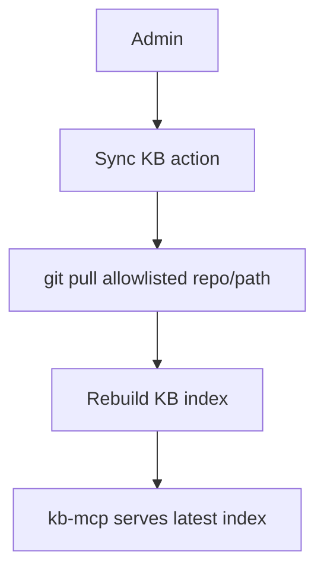

# MCP Design — app2 v2.0.0

> MCP is the controlled tool layer for app2. It replaces opencode-managed tools with app-owned tool governance.

---

## MCP Principles

- MCP tools are app-controlled, not freely exposed to the LLM.
- Start read-only by default.
- Enable tools per page and role.
- Log every tool call.
- Prefer small, focused MCP servers over one large server with many unrelated tools.
- Keep destructive tools out of v2.0.0 unless an explicit human approval flow exists.

---

## Tool Orchestration Model

app2 owns the tool loop in v2.0.0. The model may suggest that more evidence is needed, but the server-side AI brain decides which allowed MCP tools to call, sanitizes the inputs, logs the call, and injects only approved excerpts back into the final model prompt.

Rules:

- Do not expose MCP server credentials, raw endpoints, or unrestricted tool schemas to the browser.
- Do not let a provider call production MCP tools directly.
- Keep role/page allowlists in app2 server-side code or server-side policy files.
- Store a truncated tool result summary in `ToolCallLog`; avoid storing secrets or oversized logs.

---

## Required MCP Servers

| Priority | Server | Purpose | Runtime |
|----------|--------|---------|---------|
| P0 | `kb-mcp` | Search and read the knowledge repo | Production |
| P0 | `case-history-mcp` | Search similar past cases and read allowed case summaries | Production |
| P1 | `web-fetch-mcp` | Fetch specific allowed URLs | Production, restricted |
| P1 | `web-search-mcp` | Search external web when KB is insufficient | Production, quota-limited |
| P1 | `docker-mcp` | Read container status/logs/stats for Operation | Production, read-only |
| P2 | `playwright-mcp` | UI smoke/regression testing | Dev/test only |
| P2 | `opencode-mcp` | Optional second opinion bridge | Later only |

---

## Tool Permission Matrix

| Server | NOC | Operation | Admin |
|--------|-----|-----------|-------|
| `kb-mcp` | allow | allow | allow |
| `case-history-mcp` | own/allowed cases | own/allowed cases | all cases |
| `web-fetch-mcp` | allowed domains only | allowed domains only | allowed domains only |
| `web-search-mcp` | low quota | low quota | configurable quota |
| `docker-mcp` | deny | read-only | read-only |
| `playwright-mcp` | deny | deny | dev/test only |
| destructive tools | deny | deny | deny in v2.0.0 |

---

## kb-mcp

### Purpose

Expose the existing knowledge repo to app2 without moving the repo into app code.

### Data Source

```text
/root/openstack-support/
  knowledge/*.yaml
  style-guide/*.md
  templates/*.md
```

### Tools

| Tool | Input | Output | Notes |
|------|-------|--------|-------|
| `kb_search` | query, category?, limit? | matched entries with source paths | Main retrieval tool |
| `kb_read` | path or entry id | full text/content | Restricted to KB root |
| `kb_categories` | none | category list | Helps model narrow search |
| `style_guide_read` | name | style guide text | Used before drafting customer replies |
| `template_read` | name | template text | Used for handoff/closure templates |

### Safety

- Read-only.
- Path traversal blocked.
- Return source path and excerpt, not the whole repo.
- Limit output size per call.

---

## case-history-mcp

### Purpose

Let app2 use previous cases as memory without stuffing all history into prompts.

### Tools

| Tool | Input | Output | Notes |
|------|-------|--------|-------|
| `case_search` | query, page?, status?, limit? | matching case metadata and summaries | Respects role filtering |
| `case_read` | caseId | case summary/detail/messages | Respects role filtering |
| `case_similar` | current message/case text | similar cases | Useful before drafting |

### Safety

- Server receives caller role/user context from app2.
- NOC and Operation users only see cases allowed by role policy.
- Admin can see all cases.
- Sensitive values should be summarized where possible.

---

## web-fetch-mcp

### Purpose

Fetch content from a specific URL when a user provides one or when a prompt explicitly needs source content.

### Tools

| Tool | Input | Output |
|------|-------|--------|
| `web_fetch` | url, maxChars? | page title, text excerpt, final URL |

### Safety

- Allowlist domains where possible.
- Block localhost/private IP ranges to reduce SSRF risk.
- Timeout hard limit.
- Max response size.

---

## web-search-mcp

### Purpose

Search external information when KB and case history are not enough.

### Tools

| Tool | Input | Output |
|------|-------|--------|
| `web_search` | query, limit?, allowedDomains? | title, URL, snippet |

### Safety

- Disabled by default for simple NOC answers.
- Use only when prompt says external search is needed.
- Daily quota in settings.
- Log query and selected result URLs.

---

## docker-mcp

### Purpose

Support Operation diagnostics without exposing destructive actions.

### Allowed v2.0.0 Tools

| Tool | Role |
|------|------|
| `list_containers` | Operation/Admin |
| `container_logs` | Operation/Admin |
| `container_stats` | Operation/Admin |
| `list_images` | Admin optional |
| `compose_ps` | Operation/Admin |
| `docker_version` | Operation/Admin |

### Denied v2.0.0 Tools

- `start_container`
- `stop_container`
- `restart_container`
- `remove_container`
- `exec_command`

---

## Knowledge Repo Sync

The repo does not need a redesign for v2.0.0.



Rules:

- Do not `git pull` on every chat request.
- Admin-only actions: check status, pull latest, rebuild index.
- Store last sync time, commit hash, and errors.
- Mount KB read-only into `kb-mcp` if sync runs outside the MCP container.

---

## Tool Call Logging

Every MCP call should write:

| Field | Example |
|-------|---------|
| `caseId` | `01077001` |
| `serverName` | `kb-mcp` |
| `toolName` | `kb_search` |
| `status` | `success` |
| `latencyMs` | `142` |
| `inputJson` | sanitized input |
| `outputText` | truncated summary |
| `createdAt` | ISO timestamp |
