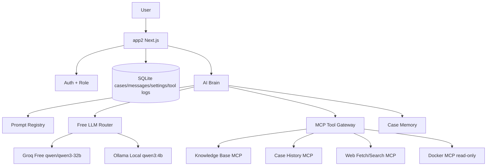

# Version 2.0.0 — app2 Free-First LLM + MCP Chatbot

> **Status:** Planned
> **Date:** 2026-07-01
> **Scope:** New `apps/app2` based on the web1 concept, replacing opencode-as-bridge with a free-first LLM router, MCP tool gateway, and local fallback.

---

## Goals

- Build `apps/app2` as the next major version of chatbot-gate.
- Reuse the current `web1` product concept: NOC chat, Operation chat, case history, settings, login, and case lifecycle.
- Replace direct app dependency on opencode with a free-first LLM router.
- Use Groq Free as the primary LLM provider with `qwen/qwen3-32b`.
- Use local Ollama with `qwen3:4b` as the no-cost fallback when Groq is unavailable or quota-limited.
- Move the app intelligence that used to live in `.opencode` into app2-owned prompt, policy, retrieval, memory, and fallback layers.
- Add MCP as controlled tool access for knowledge, case history, web fetch/search, and read-only operations diagnostics.
- Keep case recording as a first-class feature.

---

## Core Decisions

| Topic | Decision |
|-------|----------|
| App strategy | Create `apps/app2`, reuse `web1` UI and flows where practical |
| Primary LLM | Groq Free |
| Primary model | `qwen/qwen3-32b` |
| Local fallback | Ollama `qwen3:4b` |
| Runtime roles | Keep NOC and Operation as separate pages and prompt profiles |
| Knowledge source | Keep the existing knowledge repo; do not migrate it into app2 |
| Knowledge access | Read through `kb-mcp` and an optional index/cache |
| Case storage | SQLite, based on the web1 case lifecycle |
| opencode | Not app2 primary path; optional MCP/tool only if later needed |

---

## Documentation Set

| File | Purpose |
|------|---------|
| `plan.md` | Version overview, scope, major decisions, implementation phases |
| `technical-design.md` | Architecture, services, routes, data model, runtime behavior |
| `mcp-design.md` | MCP list, tool permissions, safety, knowledge repo sync |
| `fallback-design.md` | Groq quota handling, retry, local Ollama fallback |
| `prompt-design.md` | App2 AI brain, prompt registry, role behavior, response style |
| `implementation-checklist.md` | Build checklist mapped to reusable web1 files and app2 deliverables |
| `deployment-plan.md` | Phase 9 infrastructure changes, nginx, docker-compose, verification |
| `mockup.html` | Standalone UI mockup (NOC, Operation, Settings, History, Fallback) |
| `ADR-0004-app2-free-first-llm-mcp.md` | Architecture decision record replacing opencode bridge for app2 |

---

## Architecture Summary

---

## Feature Scope

### NOC Chat

- Analyze customer messages.
- Search the knowledge repo before drafting when relevant.
- Draft formal Thai customer responses.
- Support feedback/revision loops.
- Close and save cases with summary, detail, messages, and tool logs.

### Operation Chat

- Analyze incidents, logs, and operational symptoms.
- Use case history and KB when relevant.
- Use Docker MCP read-only tools for container status/logs when enabled.
- Produce structured diagnosis and action recommendations.
- Close and save cases.

### AI Brain

- Replace `.opencode` as the runtime brain for app2.
- Store role instructions, prompt templates, tool policy, and fallback behavior in app2-owned files/config.
- Keep prompts editable without changing core UI logic where possible.

### MCP Gateway

- Load only allowed tools per role and page.
- Log each tool call, result summary, latency, and error.
- Prefer read-only tools in v2.0.0.
- Require explicit confirmation before any future state-changing tool.

### Knowledge Sync

- Keep the existing knowledge repo as the source of truth.
- Add admin-only sync behavior: pull latest, rebuild index, show status.
- Do not run `git pull` on every user question.

---

## Out Of Scope

- Paid LLM billing setup.
- Fine-tuning model weights.
- Migrating knowledge repo content into app2 DB.
- Replacing the knowledge repo structure upfront.
- Letting LLM execute destructive Docker/Git commands.
- Removing `web1` before app2 is proven.

---

## Implementation Phases

| Phase | Goal | Output |
|-------|------|--------|
| 0 | Design | Complete docs and ADR |
| 1 | Prototype | Minimal Groq Free call + Ollama fallback endpoint |
| 2 | App shell | `apps/app2` copied/adapted from `web1` |
| 3 | AI brain | Prompt registry, LLM router, structured responses |
| 4 | MCP | `kb-mcp`, `case-history-mcp`, tool policy/logging |
| 5 | Case lifecycle | DB-backed messages, close flow, history/export |
| 6 | Eval | Thai test cases for NOC and Operation |
| 7 | Deploy | Run app2 alongside web1 and verify rollback path |

---

## Success Criteria

- NOC and Operation chats work without opencode.
- Groq Free is used as primary and Ollama `qwen3:4b` is used when primary fails.
- Knowledge answers cite or summarize KB sources through MCP retrieval.
- Cases and message history are persisted in SQLite.
- Tool calls are visible in logs for debugging.
- App2 can run alongside web1 without breaking the existing deployment.
