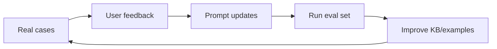

# Prompt Design — app2 v2.0.0 AI Brain

> The app2 AI brain replaces the `.opencode` runtime brain for chatbot behavior.

---

## Concept

Do not fine-tune model weights in v2.0.0. The free and no-GPU strategy is to make the model smarter through prompt design, retrieval, case memory, tool policy, and evaluation.

```text
LLM free model = base brain
Prompt registry = behavior and role instructions
Knowledge repo = company knowledge
MCP tools = controlled hands and eyes
Case history = memory
Eval set = quality test
```

---

## Replacement For `.opencode`

| `.opencode` Role | app2 Replacement |
|------------------|------------------|
| agents | role prompt files |
| prompts | prompt registry |
| permissions | tool policy |
| MCP config | MCP gateway settings |
| provider config | LLM router settings |
| session handling | app2 DB-backed case messages |

---

## Suggested File Layout

```text
apps/app2/gate-answer-app2/
  roles/
    noc.md
    operation.md
  prompts/
    noc-analyze.md
    noc-chat.md
    noc-draft.md
    noc-draft-feedback.md
    noc-close.md
    operation-chat.md
    operation-close.md
  examples/
    noc-good-replies.md
    operation-good-diagnosis.md
  policies/
    noc-tools.json
    operation-tools.json
```

---

## Global Response Style

All customer-facing Thai responses should follow the project style guide:

- Open with `เรียน ผู้ใช้บริการ`.
- Use formal Thai.
- Keep technical terms in English when they are clearer.
- Do not mention OpenStack, API, CLI, backend, internal tools, or provider names directly to customers.
- Close with `ขอบคุณครับ`.
- If evidence is insufficient, ask for the minimum additional information needed.

Operation/internal responses can be more direct and structured, but should still be in Thai unless the source log requires English terms.

---

## Role: NOC

### Responsibilities

- Understand customer issue text.
- Search KB before making product/process claims.
- Classify likely category.
- Draft customer-safe Thai replies.
- Suggest escalation when confidence is low.
- Close case with summary and detail.

### Allowed Tools

- `kb_search`
- `kb_read`
- `style_guide_read`
- `template_read`
- `case_search`
- `case_similar`
- `web_fetch` only for allowed URLs
- `web_search` only when KB is insufficient and policy allows it

### Default Behavior

```text
1. Read the user message.
2. Search KB if the answer depends on product/process knowledge.
3. Search similar cases if the issue pattern is unclear.
4. Produce concise analysis and a customer-ready Thai draft.
5. Do not expose tool internals to the customer.
```

---

## Role: Operation

### Responsibilities

- Analyze incident text, logs, and symptoms.
- Identify likely cause and impact.
- Suggest safe next actions.
- Use read-only Docker status/log tools when enabled.
- Record case summary and technical detail.

### Allowed Tools

- `kb_search`
- `kb_read`
- `case_search`
- `case_similar`
- `docker_version`
- `compose_ps`
- `list_containers`
- `container_logs`
- `container_stats`
- `web_fetch` only for allowed URLs

### Denied Tools

- `exec_command`
- `restart_container`
- `stop_container`
- `remove_container`
- Any raw shell tool

---

## Prompt Variables

| Variable | Source |
|----------|--------|
| `{{MESSAGE}}` | Current user message |
| `{{CASE_ID}}` | Current case id |
| `{{PAGE}}` | NOC or Operation |
| `{{USER_ROLE}}` | Authenticated role |
| `{{CASE_SUMMARY}}` | Current case summary if available |
| `{{RECENT_HISTORY}}` | Recent message history |
| `{{KB_RESULTS}}` | Retrieved KB excerpts |
| `{{CASE_RESULTS}}` | Similar case excerpts |
| `{{FEEDBACK}}` | User feedback for draft revision |

---

## Few-Shot Examples

Few-shot examples should be stored separately from the base role prompt so they can be edited and tested.

Use examples for:

- Good formal NOC reply.
- Good escalation summary.
- Good Operation diagnosis.
- Bad answer patterns to avoid.

Keep examples short. Free models have limited practical quota and context budget.

---

## Evaluation Set

Create a small Thai eval set before production cutover.

| Eval Group | Count |
|------------|-------|
| NOC common customer issues | 10 |
| NOC ambiguous issues | 5 |
| NOC draft quality | 5 |
| Operation log/incident analysis | 10 |
| Fallback local model behavior | 5 |

Each eval case should include:

- User input.
- Expected KB category or source.
- Expected answer traits.
- Forbidden claims.
- Pass/fail notes.

---

## Quality Loop



This is the free replacement for model training.
