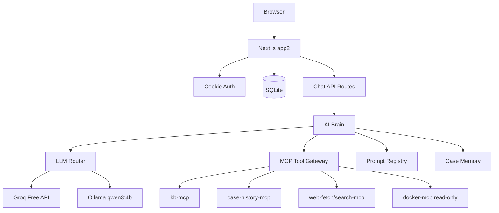

# Technical Design — Version 2.0.0 app2

> Scope: `apps/app2`, free-first LLM router, MCP gateway, app-owned AI brain, case persistence.

---

## System Architecture



---

## App Layout

`apps/app2` should start by copying useful pieces from `apps/web1`, then replacing the opencode-specific AI integration.

| Area | Reuse From web1 | app2 Change |
|------|-----------------|-------------|
| Auth | yes | Keep cookie auth and roles |
| Layout/sidebar | yes | Rename product/version and app2 routes |
| NOC page | yes | Replace opencode calls with app2 chat API |
| Operation page | yes | Replace opencode calls with app2 chat API |
| History page | yes | Add tool log visibility later |
| Settings page | partial | Replace opencode settings with LLM/MCP settings |
| DB/case code | yes | Extend for model/tool metadata |
| opencode service | no | Replace with LLM router and MCP gateway |

---

## Runtime Services

| Service | Responsibility |
|---------|----------------|
| `llm-router.ts` | Select Groq primary or Ollama fallback; normalize request/response |
| `providers/groq.ts` | Groq OpenAI-compatible API adapter |
| `providers/ollama.ts` | Ollama local API adapter |
| `ai-brain.ts` | Build prompts, attach tools, apply role policy |
| `prompt-registry.ts` | Load role/action prompts from app2 prompt files |
| `mcp-gateway.ts` | Connect to MCP servers and expose allowed tools |
| `tool-policy.ts` | Role/page allowlist and denylist |
| `case-memory.ts` | Retrieve current/previous case context |
| `knowledge-sync.ts` | Admin-only repo pull and index rebuild |

Suggested paths:

```text
apps/app2/src/lib/ai/llm-router.ts
apps/app2/src/lib/ai/providers/groq.ts
apps/app2/src/lib/ai/providers/ollama.ts
apps/app2/src/lib/ai/ai-brain.ts
apps/app2/src/lib/ai/prompt-registry.ts
apps/app2/src/lib/mcp/mcp-gateway.ts
apps/app2/src/lib/mcp/tool-policy.ts
apps/app2/src/lib/knowledge/knowledge-sync.ts
apps/app2/gate-answer-app2/prompts/*.md
apps/app2/gate-answer-app2/roles/*.md
```

---

## Chat Flow

```mermaid
sequenceDiagram
  participant U as User
  participant A as app2 API
  participant B as AI Brain
  participant R as LLM Router
  participant G as Groq
  participant O as Ollama
  participant M as MCP Gateway
  participant D as SQLite

  U->>A: POST message
  A->>D: Save user message
  A->>B: Build role prompt and tool policy
  B->>M: Run allowed retrieval/tool steps
  M-->>B: Sanitized tool context and logs
  B->>R: Send prompt plus approved context
  R->>G: Try Groq qwen/qwen3-32b
  G-->>R: Response
  R->>O: Fallback request if Groq fails/quota-limits
  O-->>R: Fallback response
  R-->>A: Normalized answer
  A->>D: Save assistant message and metadata
  A-->>U: Return/stream answer

  Note over B,M: app2 controls MCP tools; providers do not receive unrestricted direct tool access.
  Note over R,O: If Groq fails or quota is exhausted, retry with Ollama qwen3:4b.
```

---

## API Routes

Keep the high-level routes familiar from web1.

| Method | Route | Purpose |
|--------|-------|---------|
| `POST` | `/api/chat/noc` | NOC init/message/draft/close actions |
| `POST` | `/api/chat/operation` | Operation init/message/close actions |
| `GET` | `/api/cases` | List cases with filters |
| `GET` | `/api/cases/export` | Markdown export |
| `GET` | `/api/settings` | Load model, fallback, MCP, KB sync settings |
| `PATCH` | `/api/settings` | Save admin settings |
| `GET` | `/api/admin/knowledge-sync/status` | Show KB repo status/index status |
| `POST` | `/api/admin/knowledge-sync/action` | Pull latest/rebuild index/check status |

---

## Database Extensions

Start from the web1 schema and add AI metadata.

```prisma
model Case {
  id        String   @id @default(uuid())
  caseId    String   @unique
  userId    String
  username  String
  userRole  String
  page      String   // NOC | Operation
  status    String   // in_progress | closed
  preview   String?
  summary   String?
  detail    String?
  createdAt DateTime @default(now())
  updatedAt DateTime @updatedAt
  closedAt  DateTime?
  messages  ChatMessage[]
  toolCalls ToolCallLog[]
}

model ChatMessage {
  id        String   @id @default(uuid())
  caseId    String
  role      String   // user | assistant | system | tool
  kind      String?  // message | draft | close | fallback_notice
  content   String
  model     String?
  provider  String?
  createdAt DateTime @default(now())
}

model ToolCallLog {
  id          String   @id @default(uuid())
  caseId      String
  messageId   String?
  serverName  String
  toolName    String
  inputJson   String?
  outputText  String?
  status      String   // success | error | denied | timeout
  latencyMs   Int?
  createdAt   DateTime @default(now())
}

model LlmCallLog {
  id             String   @id @default(uuid())
  caseId          String?
  provider        String
  model           String
  status          String   // success | error | fallback
  inputTokens     Int?
  outputTokens    Int?
  latencyMs       Int?
  errorCode       String?
  errorMessage    String?
  createdAt       DateTime @default(now())
}
```

Exact Prisma implementation can be simplified during build if needed, but the system must store provider/model/tool visibility somewhere.

---

## Environment Variables

| Variable | Required | Purpose |
|----------|----------|---------|
| `GROQ_API_KEY` | yes for primary | Groq Free API access |
| `OLLAMA_BASE_URL` | yes for fallback | Defaults to `http://ollama:11434` in Docker |
| `APP2_PRIMARY_PROVIDER` | optional | Default `groq` |
| `APP2_PRIMARY_MODEL` | optional | Default `qwen/qwen3-32b` |
| `APP2_FALLBACK_PROVIDER` | optional | Default `ollama` |
| `APP2_FALLBACK_MODEL` | optional | Default `qwen3:4b` |
| `KNOWLEDGE_REPO_PATH` | yes | Host/container path for knowledge repo |
| `MCP_KB_URL` | yes | KB MCP endpoint |
| `MCP_CASE_HISTORY_URL` | yes | Case history MCP endpoint |
| `MCP_DOCKER_URL` | optional | Docker MCP endpoint |

---

## Deployment Shape

Initial production can run app2 alongside web1.

```text
nginx
  /        -> web1 during transition
  /app2    -> app2

containers:
  nginx
  web1
  app2
  ollama
  kb-mcp
  case-history-mcp
  docker-mcp
```

Ollama should preload `qwen3:4b`. The local model is a fallback, not the expected primary path.

---

## Security Rules

- Never expose raw shell execution to the browser.
- Do not let the LLM decide unrestricted tools.
- Tool policy must be server-side.
- Docker MCP is read-only in v2.0.0.
- Knowledge sync is admin-only and allowlisted.
- Store API keys only in environment variables or server-side settings storage.
- Log tool calls, but avoid storing secrets in tool input/output logs.
